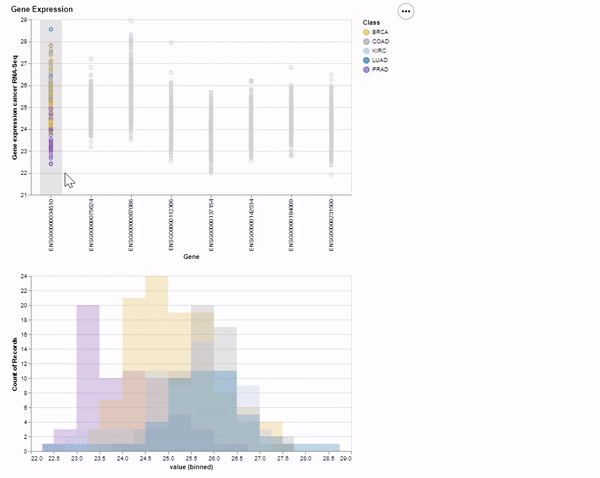

# ml-pancancer-example

## Description

**Data Science and Machine Learning with PANCANCER data – example**

This is an introduction to Data Science and Machine Learning techniques focus on three levels of expertise: 

* Beginner
* Intermediate
* Advanced

The project assumes some knowledge or experience with **python** or **R**,
but will show and walk through the
data analysis process.
To access the data,
please see the [data README](data/).

## Beginner Notebook Tutorial

In this notebook we will work through the process of data analysis for the [gene expression cancer RNA-Seq Data Set](https://archive.ics.uci.edu/ml/datasets/gene+expression+cancer+RNA-Seq#). 
This is the beginner or novice notebook and we will focus on general data cleanup, manipulation, and 
analysis techniques in python.

We Focus on:
* Importing Python libraries for data analysis
	- Data Manipulation and Data Processing
		- pandas
		- numpy
	- Data Visualization
		- Matplotlib
		- Seaborn
		- Altair
* Dealing with Data Cleaning and Processing
	- loading dataframes
	- dealing missing or problematic features
	- subsetting data
* Beginner Data Analysis Techniques
	- Exploratory Data Analysis (EDA)
	- Generating Summary Statistics

By the end of the tutorial you will be familiar with dealing with data and creating charts 
for your research and data analysis like these:

## Intermediate Tutorial Notebook

