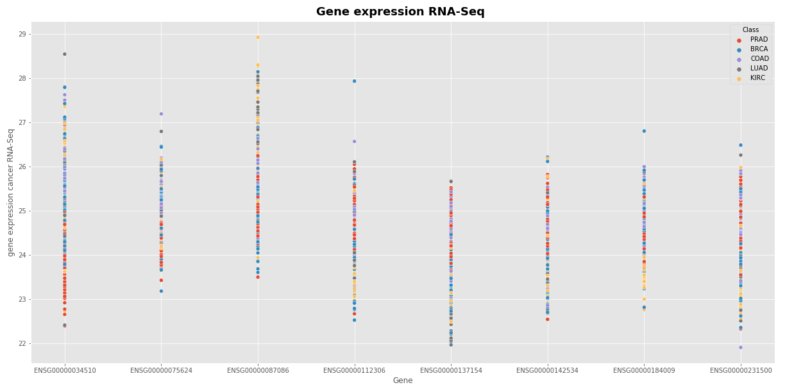
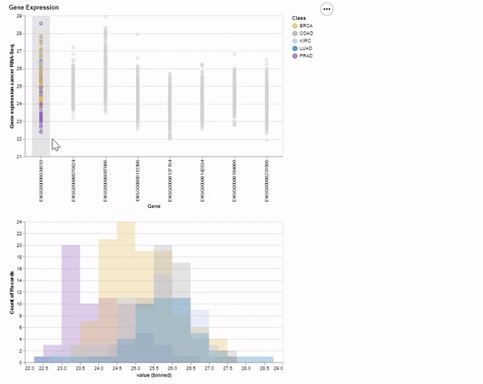

# ml-pancancer-example

## Description

**Data Science and Machine Learning with PANCANCER data – example**

This is an introduction to Data Science and Machine Learning techniques focus on three levels of expertise: 

* Beginner
	- Exploratory Data Analysis 
	- General data analytics through python
* Intermediate
	- Statistical background
	- Hypothesis Testing
	- Statistical Simulations
	- Python User Defined Functions
* Advanced
	- General Background Theory in Machine Learning models
	- Techniques for using _Scikit-Learn_ ML models in python
	- Classification and Clustering ML models
	- Model Performance and improvements

The project assumes some knowledge or experience with **python** or **R**,
but will show and walk through the
data analysis process. Each of the tutorials are developed to stand on their own, meaning you could jump into the
tutorial notebook you are interested in, but it is highly encourage to start from the _Beginner_ tutorial and move
through each in progression.
To access the data,
please see the [1-Data README](1-Data/).

## _Beginner_ Notebook Tutorial

In this notebook we will work through the process of data analysis for the [gene expression cancer RNA-Seq Data Set](https://archive.ics.uci.edu/ml/datasets/gene+expression+cancer+RNA-Seq#)
and the genomic count data obtained from the [TCGA projects from the National Cancer Institute's Genomic Data Commons](https://www.dropbox.com/sh/jke9h4km90ner9l/AAD1UyucvlXIFbKTjl-D15U6a?dl=0). 
This is the beginner or novice notebook and we will focus on general data cleanup, manipulation, and 
analysis techniques for the _data science process_ in python.

We Focus on:
* Importing Python libraries for data analysis
	- Data Manipulation and Data Processing
		- pandas
		- numpy
	- Data Visualization
		- Matplotlib
		- Seaborn
		- Altair
* Dealing with Data Cleaning and Processing
	- loading dataframes
	- dealing missing or problematic features
	- subsetting data
* Beginner Data Analysis Techniques
	- Exploratory Data Analysis (EDA)
	- Generating Summary Statistics

By the end of the tutorial you will be familiar with dealing with data and creating charts 
for your research and data analysis like these:

## _Intermediate_ Tutorial Notebook

This is the intermediate level notebook for the Data Science (DS) and Machine Learning (ML) FredHutch.io tutorial, where we will work through beginning to end on different aspects and techniques in DS for Statistical Testing in Research and Data Analysis.

In this notebook we will work through the process of data analysis for the [gene count TCGA Data Set](https://www.dropbox.com/sh/jke9h4km90ner9l/AAD1UyucvlXIFbKTjl-D15U6a?dl=0). **We will be using some findings from the Beginner Tutorial Notebook.**

This is the intermediate notebook and we will  focusing specifically on statistical testing and regression models in **python**. We will keep working with *python libraries* introduced in the Beginner Tutorial and introduce some new libraries with special purposes in statistics.
> **Libraries Used in This Tutorial**
* Data Manipulation and Processing
     - [pandas]( https://pandas.pydata.org/)
     - [numpy]( https://numpy.org/)
* Data Visualization
	- [Matplotlib](https://matplotlib.org/)
    - [Seaborn](https://seaborn.pydata.org/)
    - [Altair](https://altair-viz.github.io/)
* Statistics
    - [SciPy](https://www.scipy.org/)
    - [Statsmodels](https://www.statsmodels.org/stable/index.html)

By the end of the tutorial, you will be familiar with dealing with best practices in developing and performing
statistical hypothesis tests for research, how to implement statistical python libraries, and how to interpret results.

## _Expert_ Tutorial Notebook

This is the expert level notebook for the Data Science (DS) and Machine Learning (ML) FredHutch.io tutorial, 
where we will work through beginning to end on different aspects and techniques in DS and ML for Research and Analysis.

In this notebook we will work through Machine Learning techniques and strategies on the 
genes data (datasets available [here](https://www.dropbox.com/sh/jke9h4km90ner9l/AAD1UyucvlXIFbKTjl-D15U6a?dl=0)) 
from the same five cancer types (BRCA, KIRC, COAD, LUAD, PRAD) from the TCGA projects available from the [National Cancer Institute's Genomic Data Commons](https://gdc.cancer.gov/). 

We will keep working with *python libraries* introduced in the Beginner and Intermediate Tutorials and introduce 
some new libraries with special purposes in **Machine Learning**.
> **Libraries Used in This Tutorial**
* Data Manipulation and Processing
     - [pandas]( https://pandas.pydata.org/)
     - [numpy]( https://numpy.org/)
* Data Visualization
	- [Matplotlib](https://matplotlib.org/)
    - [Seaborn](https://seaborn.pydata.org/)
    - [Altair](https://altair-viz.github.io/)
* Statistics
    - [Scipy](https://www.scipy.org/)
    - [Statsmodels](https://www.statsmodels.org/stable/index.html)
* Machine Learning
    - [Scikit-Learn](https://scikit-learn.org/stable/)
    
In this notebook we will be focusing specifically on Machine Learning modeling in **python**. We'll primariy focus in:
* Introducing what Machine Learning is
* Fundamental concepts and techniques in ML
* Introduce and familiarize with using **Scikit-Learn**
* Fundamental categories of models
* Some specific examples with regression and clustering ML models.

